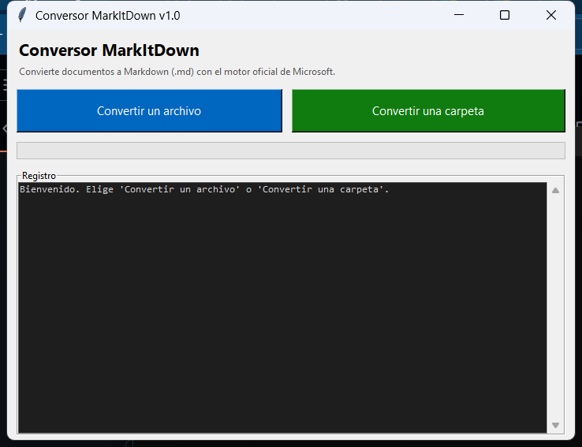

# Conversor MarkItDown

Aplicación de escritorio para Windows que convierte documentos a Markdown (`.md`)
usando el motor oficial [MarkItDown de Microsoft](https://github.com/microsoft/markitdown).



## Contenido del proyecto

| Archivo | Descripción |
|---|---|
| `app.py` | Código fuente de la aplicación (interfaz Tkinter). |
| `requirements.txt` | Dependencias de Python. |
| `build_exe.bat` | Script que genera el ejecutable `.exe`. |
| `dist/ConversorMarkItDown.exe` | **El ejecutable final que envías a tus usuarios.** |
| `LEEME - Instrucciones para usuarios.txt` | Instrucciones para el usuario final. |

## Qué enviar a los usuarios

Solo dos archivos (puedes comprimirlos en un `.zip`):

1. `dist\ConversorMarkItDown.exe`
2. `LEEME - Instrucciones para usuarios.txt`

No necesitan instalar Python ni nada más.

## Funciones

- **Convertir un archivo**: diálogo para elegir el archivo y dónde guardarlo.
- **Convertir una carpeta**: convierte por lotes; genera un `.md` por documento,
  con opción de incluir subcarpetas.
- Registro de avance y manejo de errores.

## Formatos soportados

PDF, Word (`.docx`), Excel (`.xlsx`), PowerPoint (`.pptx`), CSV, HTML, XML, JSON,
TXT, EPUB, ZIP, imágenes (PNG/JPG…), audio (MP3/WAV, requiere internet), MSG, etc.

## Regenerar el ejecutable (si modificas `app.py`)

Doble clic en `build_exe.bat`, o desde la terminal:

```bat
python -m pip install -r requirements.txt
python -m PyInstaller --onefile --windowed --name "ConversorMarkItDown" --collect-all markitdown --collect-all magika app.py
```

El resultado queda en `dist\ConversorMarkItDown.exe`.

## Ejecutar sin compilar (modo desarrollo)

```bat
python -m pip install -r requirements.txt
python app.py
```

## Notas técnicas

- Construido con Python 3.14 + Tkinter + PyInstaller (modo `--onefile --windowed`).
- El `.exe` incluye metadatos de versión (editor **Rodrigo Contreras**, motor
  **Microsoft MarkItDown**), definidos en `version_info.txt`.
- Tamaño aproximado del `.exe`: ~100 MB (incluye todas las dependencias).

## Firma digital

El `.exe` está firmado con un **certificado autofirmado** ("Rodrigo Contreras")
y sello de tiempo (DigiCert). Esto **no elimina** el aviso de Windows SmartScreen
en equipos ajenos, porque el certificado no proviene de una Autoridad
Certificadora (CA) de confianza pública.

- **Distribución pública:** para quitar el aviso por completo se necesita un
  certificado de firma de código **OV** (la reputación se acumula con las
  descargas) o **EV** (reputación inmediata) de una CA como Sectigo o DigiCert.
- **Uso interno / empresa:** en los PCs de destino, importa el certificado
  público `docs/RodrigoContreras-CodeSigning.cer` en los almacenes
  *Entidades de certificación raíz de confianza* y *Editores de confianza*
  (requiere permisos de administrador). Tras ello, Windows reconocerá la firma
  como válida y no mostrará "Editor desconocido".
- Si aparece SmartScreen: **"Más información" → "Ejecutar de todas formas"**.

### Volver a firmar tras recompilar

```powershell
$signtool = "C:\Program Files (x86)\Windows Kits\10\bin\10.0.26100.0\x64\signtool.exe"
& $signtool sign /fd SHA256 /a /tr "http://timestamp.digicert.com" /td SHA256 `
    "dist\ConversorMarkItDown.exe"
```
